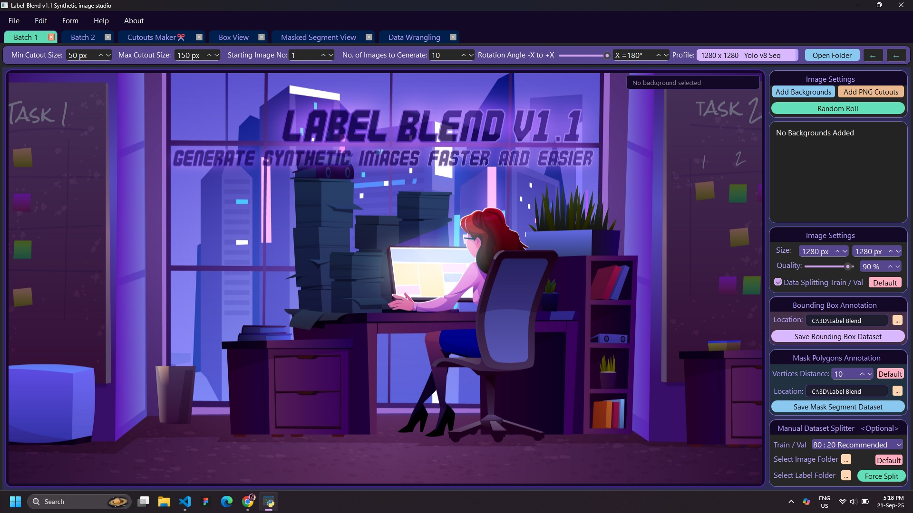
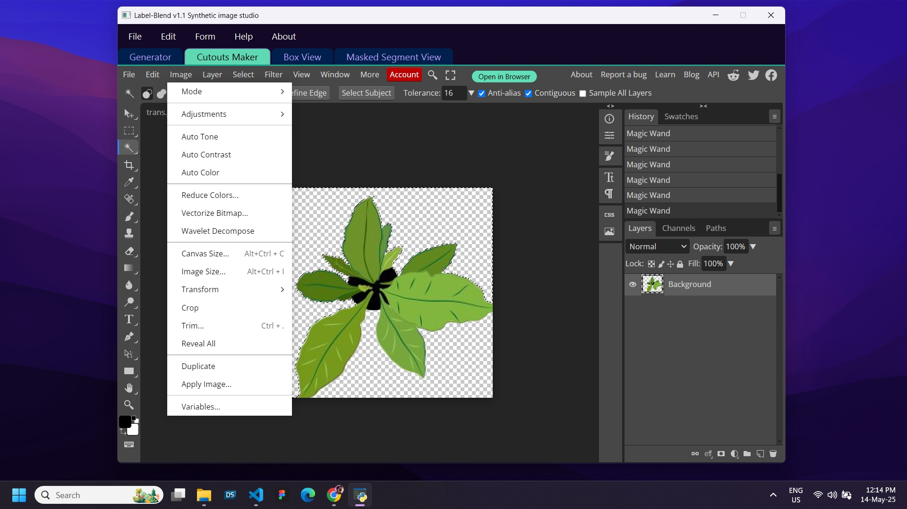
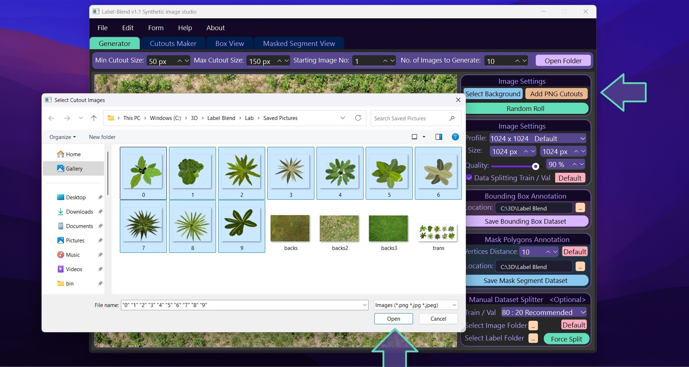
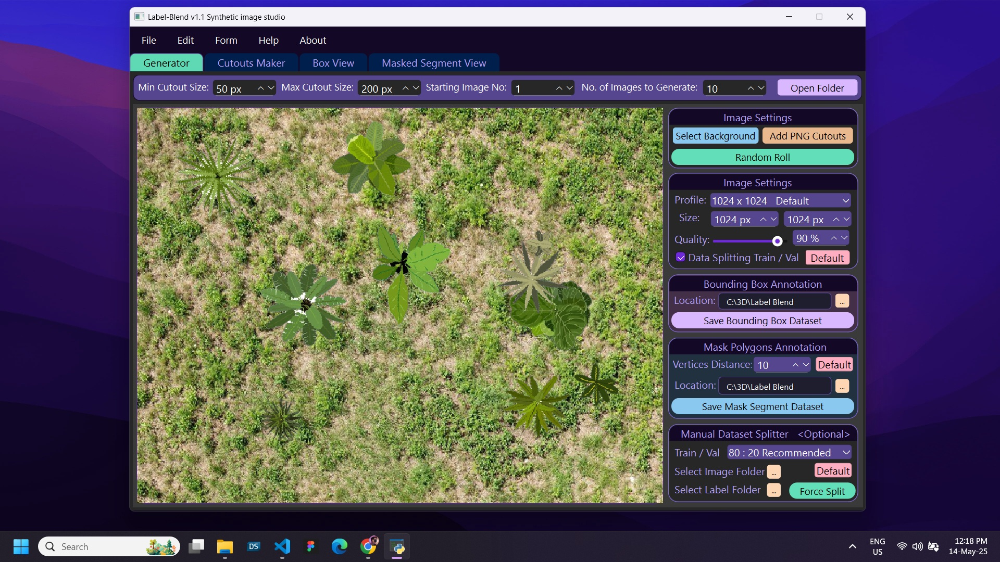
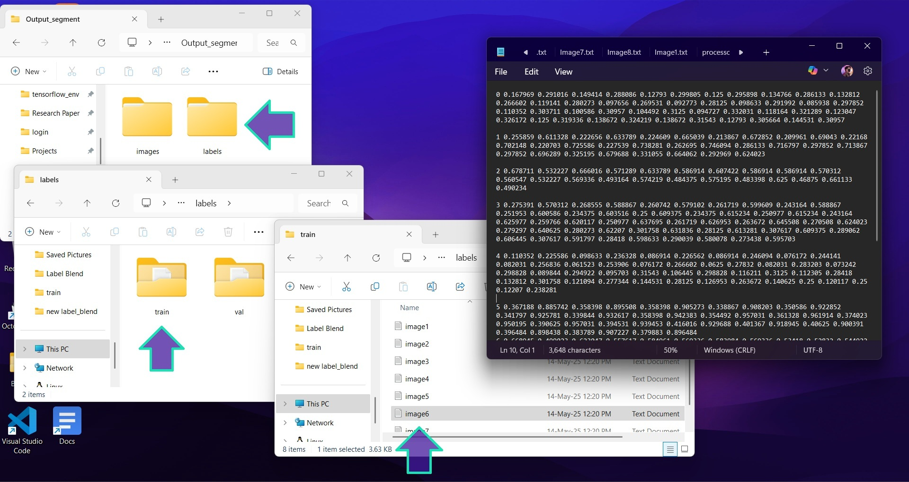
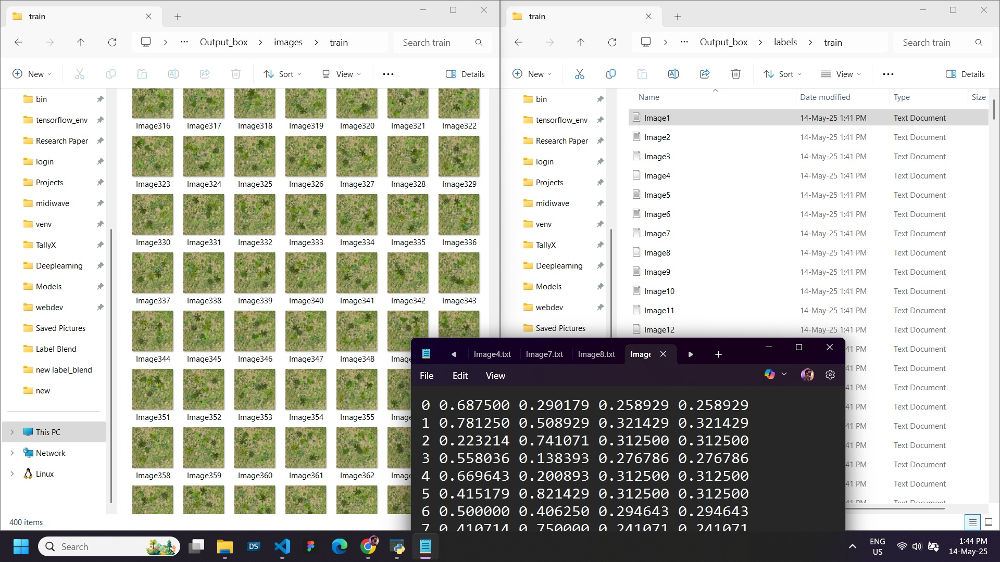
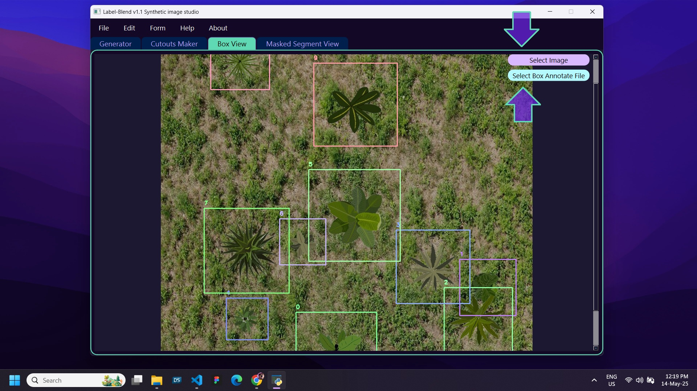
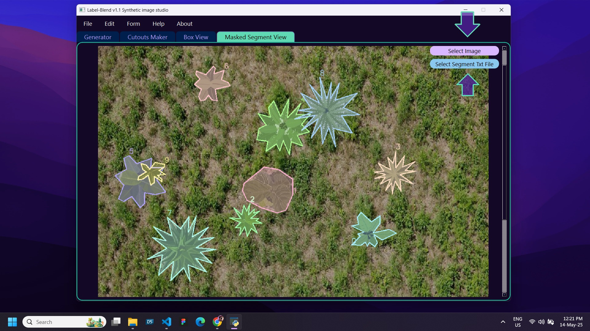

# 🧠 LabelBlend v1.1 — AI Powered Image segmentation and augmentation Tool For computer vision.

Model used as backend - META (SAM 2) Vision Transformer Model

**LabelBlend** is a powerful and user friendly desktop application tool designed for generating high-quality labelled dataset of synthetic images with random augmentation and lightning. developed for AI practitioners, computer vision engineers, and researchers, it allows automatic seamless placement over randomized backgrounds to create rich, labeled datasets for model training. it uses png cutouts and merge with background environment with random location, rotation and scaling vectors. its uses a concept called synthetic data generation to fulfill the labelled data scarcity and underfitting problem in computer vision.

## Project Tutorial on Youtube

> 🚀 By labelblend, now we can create multi-class datasets with bounding box or segmentation annotations for AI/ML pipelines in minutes or even seconds.

## ✨ Key Features

- 🎨 **User Friendly easy to use**: Load cutouts and background images easily.
- 🏷️ **Auto Label Generation**: Creates YOLO-format `.txt` annotations alongside each synthetic image.
- 🔁 **Randomized Augmentation**: Applies rotation, scaling, and random placement.
- 🎨 **Inbuilt Photoshope**: User can create cutouts inside the 'cutouts maker' Tab.
- ✅ **Annotations**: Supports both Bounding and Mask Segmentation annotation. 
- 🗂️ **Multi-class Support**: Generate data for multiple object classes simultaneously.
- 📦 **Export-Ready Datasets**: Structured output folder with `images/` and `labels/`.
- ⏩ **Multiprocessing** :  it uses modern approach to generate dataset parallely by using multiprocessing and threading.
- 📦**Object Oriented workflow**: user can open multiple workspace, so that it can work on different datasets simultaneously.
  
## 📸 Project Insights

| Home | Inbuilt image editor |
|--------------|---------------|
|  |  |

| Adding cutouts | Workspace |
|--------------|---------------|
|  |  |

| Output structure | Datasets |
|--------------|---------------|
|  |  |

| Bounding box | Segment |
|--------------|---------------|
|  |  |

🧪 Use Cases and Applications:-
LabelBlend is designed to be a core utility for:
      
      🧠 Training computer vision models (YOLO, SSD, Mask R-CNN, etc.)
      🧬 Creating synthetic data for deep learning pipelines
      🏭 Augmenting data in industrial automation and robotics
      📊 Academic research in AI/ML
      🚗 Datasets for modern agricultural Ai applications,autonomous driving, object detection, or instance segmentation

📌 How to Use:-
    
    1.Load transparent cutout images with class labels.
    2.Add background images.
    3.Set parameters:-

          a.Number of images to generate
          b.Minimum/maximum size for cutouts
          c.Starting image number
    
    4.Click Generate.
    5.Check output/images/ and output/labels/ for results.

📎 Notes
      
      Images are resized and randomly rotated before placement.
      YOLO annotations are normalized (x_center, y_center, width, height).
      You can use the generated dataset directly with YOLOv5, YOLOv8, etc.

## 🛠️ Installation

### 📍 Requirements
- Python 3.10+
- pipenv (Python virtual environment manager)

### 🔧 Setup Instructions

# Clone the repository
[git clone https://github.com/yourusername/LabelBlend.git](https://github.com/Abhii0007/Label-Blend-Studio.git)
    
cd LabelBlend

# Install pipenv if not already installed
pip install pipenv

# Install all dependencies
pipenv install

# Activate virtual environment
pipenv shell

# Run the application
python main.py

🤝 Contributing
    Meta SAM 2 Model Source - 
    https://github.com/facebookresearch/sam2
    
    Contributions, feedback, and feature requests are welcome! Please open an issue or submit a pull request.

📜 License
        
    This project is licensed under the MIT License. See the LICENSE file for details.

👨‍💻 Author
    
    Developed by Abhishek — Passionate about AI, ML, and building tools that bridge data and models.
